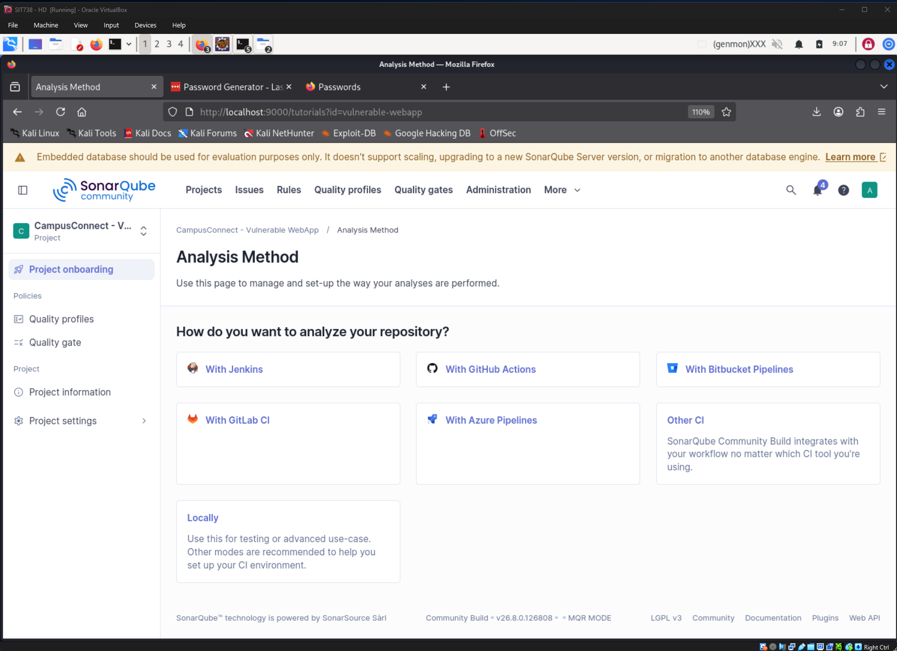
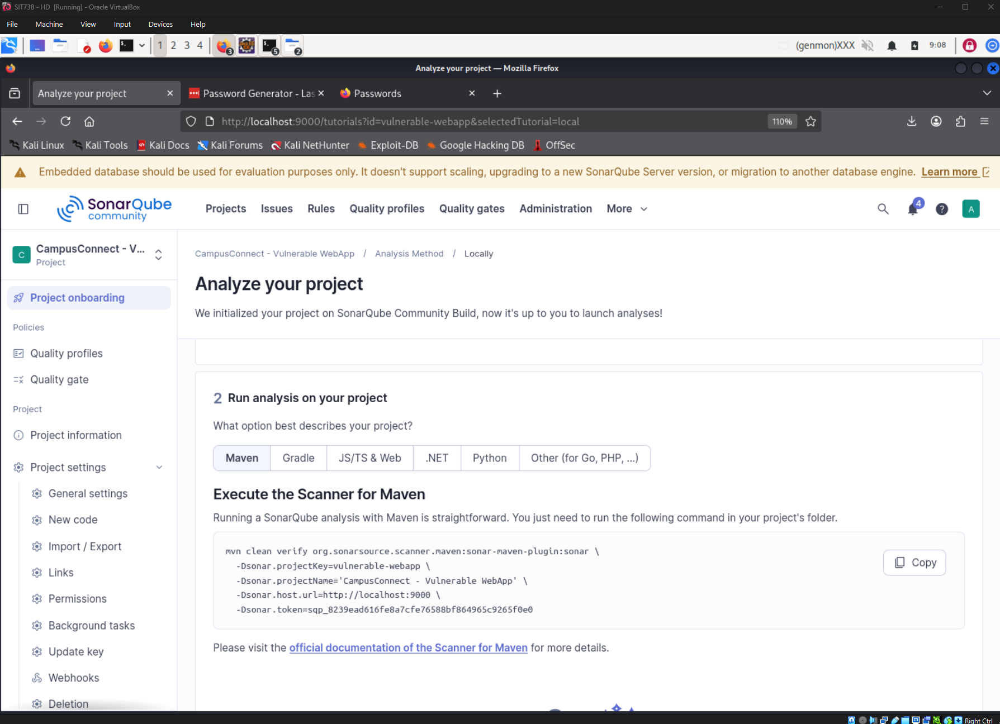
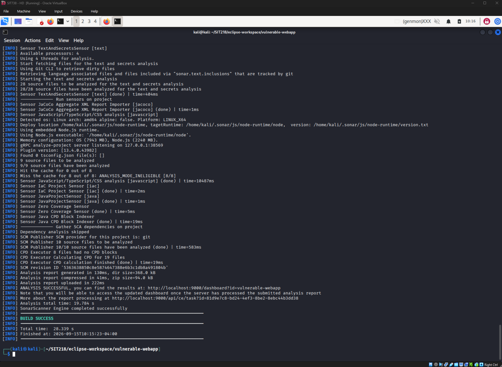
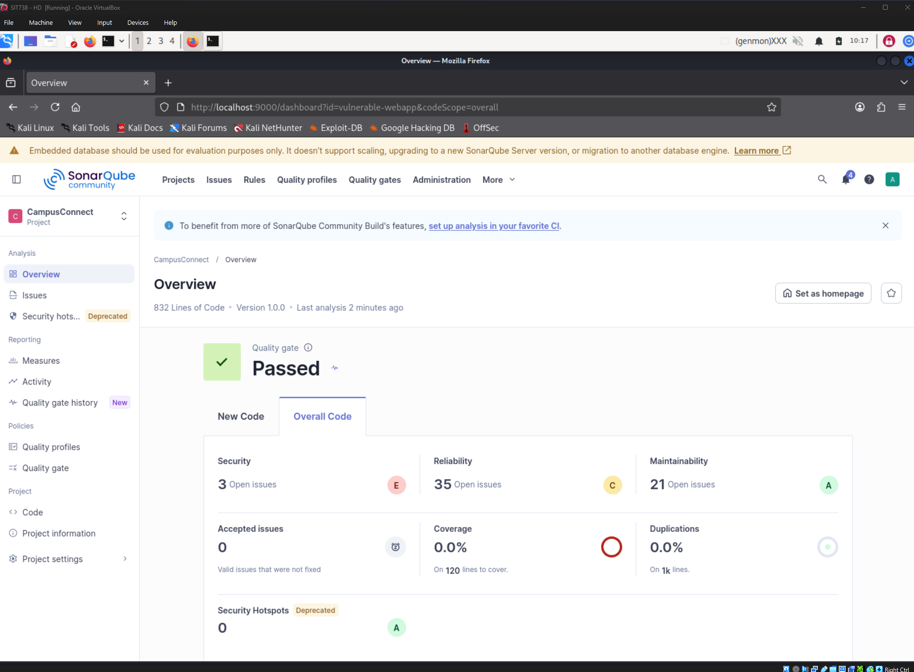
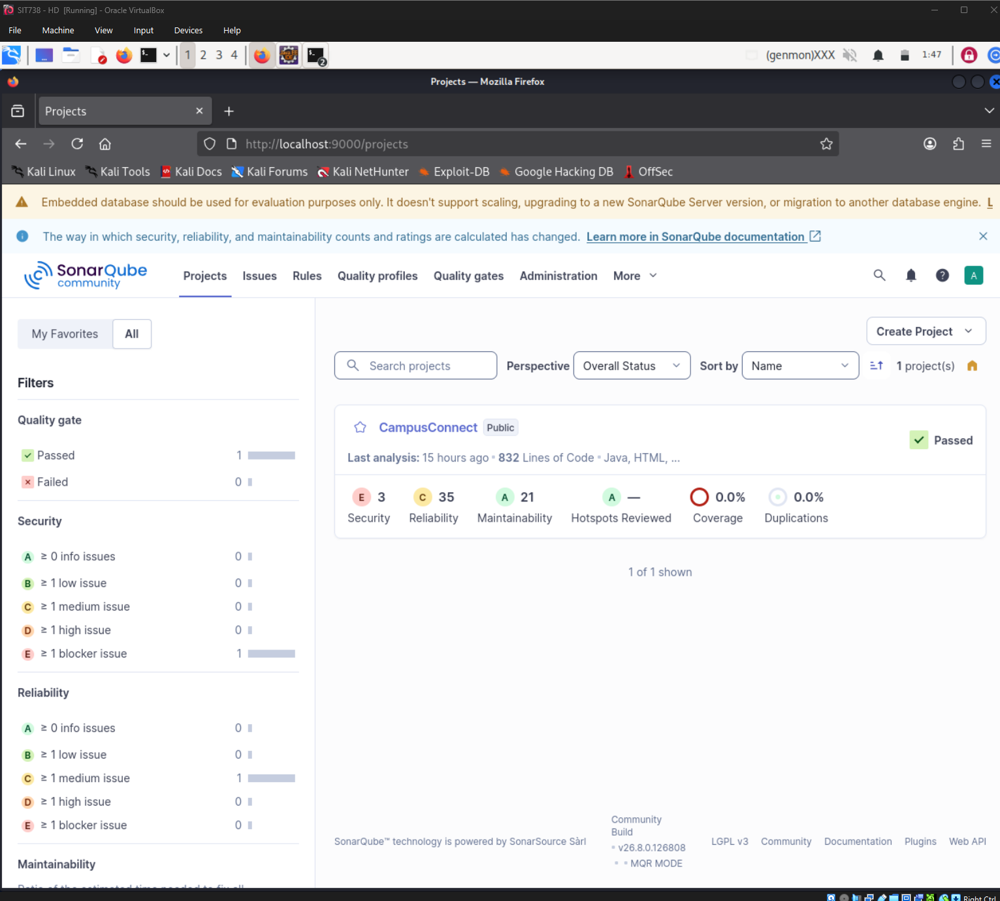
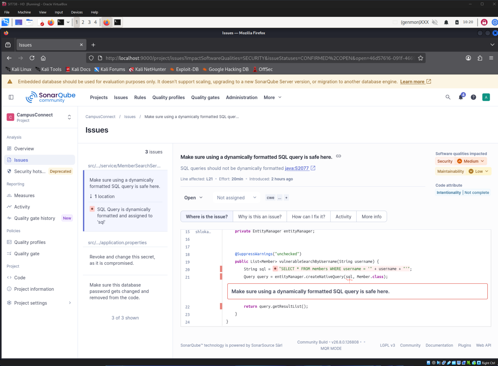
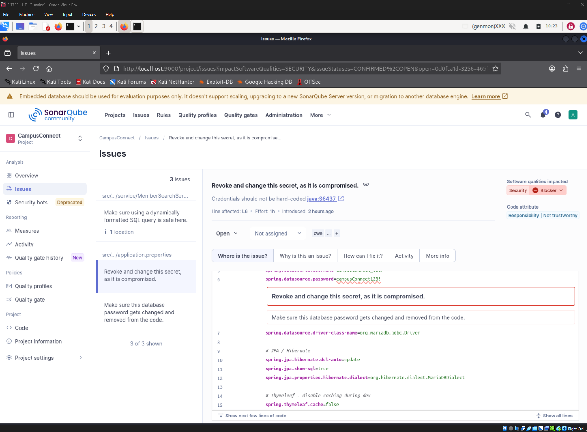
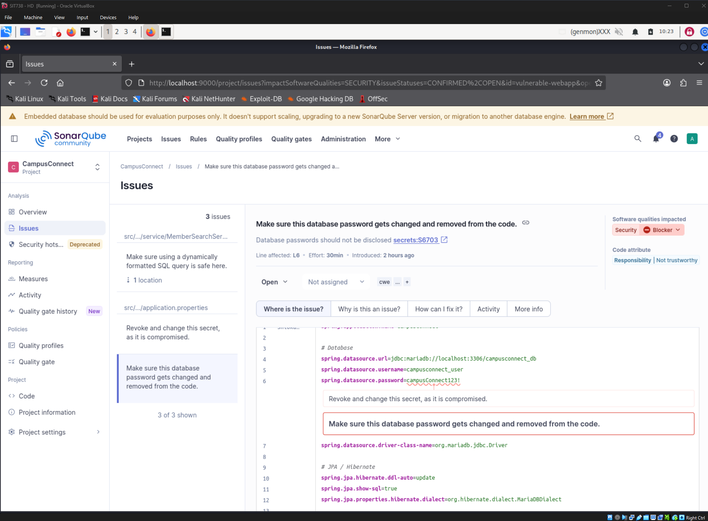

# CampusConnect — Static Application Security Testing (SonarQube)

**SIT218/SIT738 Secure Coding — Task 7.3HD, Task 2, Phase 2**

This document tracks the SonarQube SAST scan run against `vulnerable-webapp`, following the pattern: **tool configured → scan executed → results reviewed → findings mapped against the six known vulnerabilities → gaps explained.** Where SonarQube did not detect a known vulnerability, that absence is documented and explained rather than omitted — a SAST tool's blind spots are as informative as its hits.

> **Evidence folder convention:** All screenshots referenced below live in the same evidence folder as Task 1. Filenames follow the pattern `T2-{finding#}_{short-description}.png`. Update the image paths below if your repo structure differs.

---

## Table of Contents

- [Tool & Scan Configuration](#tool--scan-configuration)
- [T2-01 — SQL Injection (Detected)](#t2-01--sql-injection-detected)
- [T2-02 — Hardcoded Database Credentials (New Finding)](#t2-02--hardcoded-database-credentials-new-finding)
- [T2-03 — Stored XSS (Not Detected)](#t2-03--stored-xss-not-detected)
- [T2-04 — CSRF (Not Detected)](#t2-04--csrf-not-detected)
- [T2-05 — Data Aggregation / IDOR (Not Detected)](#t2-05--data-aggregation--idor-not-detected)
- [T2-06 — Unrestricted File Upload (Not Detected)](#t2-06--unrestricted-file-upload-not-detected)
- [SAST Tooling Limitations](#sast-tooling-limitations)
- [Evidence Checklist](#evidence-checklist-task-2-phase-2)

---

## Tool & Scan Configuration

| | |
|---|---|
| Tool | SonarQube Community Build v26.8.0.126808 |
| Analysis method | SonarScanner for Maven (`org.sonarsource.scanner.maven:sonar-maven-plugin:sonar`) |
| Project key | `vulnerable-webapp` |
| Scan scope | Full source tree: 28 Java/config files, 9 HTML/Thymeleaf templates — 832 lines of code total |
| Result | Quality Gate: **Passed** · 47 total issues (3 Security, 35 Reliability, 21 Maintainability) |

### Evidence

| Screenshot | Description |
|---|---|
|  | `T2-01` — SonarQube project initialized for `vulnerable-webapp` |
|  | `T2-02` — SonarQube-generated Maven scan command with project key and token |
|  | `T2-03` — Terminal output: `BUILD SUCCESS`, `ANALYSIS SUCCESSFUL` |
|  | `T2-04` — Overview dashboard: Quality Gate Passed, Security/Reliability/Maintainability counts |
|  | `T2-05` — Complete Issues list, 47 of 47 shown — the baseline all findings below are drawn from |

---

## T2-01 — SQL Injection (Detected)

### Objective
Confirm whether SonarQube's static analysis independently flags the SQL Injection vulnerability built in Task 1.

### Location
| | |
|---|---|
| Vulnerable code | `src/main/java/com/campusconnect/service/MemberSearchService.java`, line 21 |
| SonarQube rule | `java:S2077` — "SQL queries should not be dynamically formatted" |
| Severity | Medium (Security) |

### Finding
```java
String sql = "SELECT * FROM members WHERE username = '" + username + "'";
Query query = entityManager.createNativeQuery(sql, Member.class);
```
SonarQube flagged the dynamic string concatenation directly building the SQL query — the same line documented as the root cause in Task 1's write-up.

### Why detected
Unlike CSRF, IDOR, or file-upload validation, this class of flaw is a recognizable **syntactic pattern** — string concatenation feeding directly into a query-execution call — that doesn't require tracing user input across multiple methods or files to identify. SonarQube's Java ruleset can match this pattern without genuine taint/dataflow analysis, which is why it succeeded here despite Community Build's broader limitations (see [SAST Tooling Limitations](#sast-tooling-limitations)).

### Evidence

| Screenshot | Description |
|---|---|
|  | `T2-06` — SonarQube finding detail pane: rule `java:S2077`, line 21 highlighted, explanation panel |

---

## T2-02 — Hardcoded Database Credentials (New Finding)

### Objective
Document a vulnerability SonarQube surfaced independently — not one of the six deliberately built in Task 1, but a genuine flaw worth capturing.

### Location
| | |
|---|---|
| Vulnerable code | `src/main/resources/application.properties`, line 6 |
| SonarQube rules | `java:S6437` — "Credentials should not be hard-coded" (main engine) **and** `secrets:S6703` — "Database passwords should not be disclosed" (dedicated secrets scanner) |
| Severity | Blocker (Security) — both rules |

### Finding
```properties
spring.datasource.password=campusConnect123!
```
Caught **twice**, by two independent sensors within the same scan — SonarQube's main Java analysis engine and its dedicated text/secrets scanner both flagged the same line.

### Why this counts as a real finding, not scan noise
The dual detection is itself notable: two differently-designed rule engines agreeing on the same line is stronger signal than either alone. This is a legitimate secret-exposure vulnerability — plaintext database credentials committed to source control — independent of, and in addition to, the six vulnerabilities built for Task 1.

### Evidence

| Screenshot | Description |
|---|---|
|  | `T2-10` — `java:S6437` finding: "Credentials should not be hard-coded," Blocker severity |
|  | `T2-11` — `secrets:S6703` finding on the same line: "Database passwords should not be disclosed," Blocker severity |

### Planned prevention (Task 3)
Externalize the credential via an environment variable or a secrets manager (e.g. Spring's support for `${DB_PASSWORD}` resolved from environment), and rotate the exposed password since it must now be treated as compromised.

---

## T2-03 — Stored XSS (Not Detected)

### Objective
Confirm whether SonarQube's static analysis independently flags the Stored XSS vulnerability built in Task 1.

### Location checked
`src/main/resources/templates/noticeboard/index.html` (the `th:utext` line documented in Task 1) — **confirmed in scope**: the file appears in SonarQube's full Issues list, flagged only for unrelated accessibility rules (missing `lang` attribute, unlabeled form inputs).

### Result
**Not detected.** No finding of any kind references the `th:utext` unescaped-output line.

### Why SonarQube missed this
The template *was* scanned — this isn't a scope gap. The gap is capability: detecting this vulnerability requires tracing that a value assigned in `NoticeboardController.createPost()` flows, unsanitized, into `th:utext` in a separate template file. That is **taint/dataflow analysis across the Java-to-template boundary**, a capability SonarQube Community Build does not include (see [SAST Tooling Limitations](#sast-tooling-limitations)). The tool's HTML/Thymeleaf ruleset is oriented toward accessibility and structural correctness, not output-encoding security.

### Evidence
Absence confirmed via `T2-05` (full 47-issue list) — no entry for `noticeboard/index.html` beyond accessibility rules.

---

## T2-04 — CSRF (Not Detected)

### Objective
Confirm whether SonarQube's static analysis independently flags the CSRF vulnerability built in Task 1.

### Location checked
`src/main/java/com/campusconnect/controller/StudyPointsController.java` — appears in the Issues list only for a generic "use constructor injection instead" reliability finding, unrelated to CSRF.

### Result
**Not detected.**

### Why SonarQube missed this
Whether a state-changing endpoint *should* require a CSRF token is an **authorization-logic question**, not a code pattern — there's no syntactic signature to match against. This is a known, general limitation of pattern-based SAST as a category, not specific to Community Build: no static analyzer, free or commercial, reliably infers "this POST endpoint moves value between accounts and therefore needs anti-forgery protection." This is precisely the gap DAST and manual testing (Phase 3) exist to cover.

### Evidence
Absence confirmed via `T2-05` (full 47-issue list) — no security-tagged finding for `StudyPointsController.java`.

---

## T2-05 — Data Aggregation / IDOR (Not Detected)

### Objective
Confirm whether SonarQube's static analysis independently flags the Data Aggregation / IDOR vulnerability built in Task 1.

### Location checked
`src/main/java/com/campusconnect/controller/ProfileController.java` — appears in the Issues list only for the same generic constructor-injection finding.

### Result
**Not detected.**

### Why SonarQube missed this
Same root cause as CSRF: "should this user be allowed to see this record?" is a business-authorization question requiring semantic understanding of the application's data-ownership model, not a pattern SonarQube's ruleset can match. This is covered by manual authenticated testing in Phase 3 instead.

### Evidence
Absence confirmed via `T2-05` (full 47-issue list) — no security-tagged finding for `ProfileController.java`.

---

## T2-06 — Unrestricted File Upload (Not Detected)

### Objective
Confirm whether SonarQube's static analysis independently flags the Unrestricted File Upload vulnerability built in Task 1.

### Location checked
`src/main/java/com/campusconnect/controller/UploadController.java` — compiles cleanly, confirmed present in `target/classes` and the scanned source tree. **Zero findings of any kind** are recorded against this file — not even generic maintainability noise.

### Result
**Not detected.**

### Why SonarQube missed this
The vulnerability is an *absence* — no extension allow-list, no content-type check, no magic-byte validation — rather than a risky pattern being present in the code. SonarQube's rule-matching approach looks for dangerous constructs it recognizes; it has no rule for "this handler accepts a file and doesn't validate it enough," since defining "enough" validation requires domain knowledge the tool doesn't have. This is covered by manual testing (uploading a disguised executable file) in Phase 3.

### Evidence
Absence confirmed via `T2-05` (full 47-issue list) — `UploadController.java` does not appear in the Issues list at all.

---

## SAST Tooling Limitations

SonarQube Community Build's own interface states this limitation directly, confirming the pattern observed across T2-03 through T2-06:

> *"SonarQube Community Build does not scan for critical injection vulnerabilities (SQL injection, XSS, and more). [Explore other editions]."*

📸 `SonarQube_Limitations.png` — this warning banner, as displayed on the project Overview dashboard.

**Summary of the gap:** Community Build's ruleset can match single-file syntactic patterns (dynamic SQL concatenation, hardcoded secrets) but lacks taint/dataflow analysis — the capability to trace untrusted input from a request parameter, across methods and files, to a dangerous sink (a database call, an unescaped template output, a missing authorization check). That capability is reserved for SonarQube's commercial editions (Developer Edition and above). Of the six vulnerabilities built in Task 1, only SQL Injection — a single-file, single-line pattern — fell within Community Build's actual detection capability. CSRF, IDOR, Unrestricted File Upload, and Stored XSS all require either commercial SAST tooling, DAST, or manual authenticated testing to demonstrate — which is the explicit justification for Phase 3 (OWASP ZAP DAST) rather than a shortfall in scan configuration.

---

## Evidence Checklist (Task 2, Phase 2)

| ID | Item | SAST Result | Rule ID(s) | Status |
|---|---|---|---|---|
| T2-01 | SQL Injection | ✅ Detected | `java:S2077` | Complete |
| T2-02 | Hardcoded DB Credentials (new finding) | ✅ Detected | `java:S6437`, `secrets:S6703` | Complete |
| T2-03 | Stored XSS | ❌ Not detected — documented with explanation | — | Complete |
| T2-04 | CSRF | ❌ Not detected — documented with explanation | — | Complete |
| T2-05 | Data Aggregation / IDOR | ❌ Not detected — documented with explanation | — | Complete |
| T2-06 | Unrestricted File Upload | ❌ Not detected — documented with explanation | — | Complete |